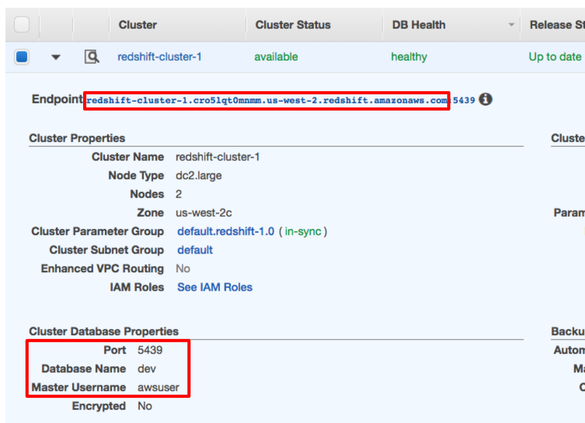

# Data-Pipelines-with-Airflow

# Introduction 
A music streaming company, Sparkify, has decided that it is time to introduce more automation and monitoring to their data warehouse ETL pipelines and come to the conclusion that the best tool to achieve this is Apache Airflow.

They have decided to bring us into the project and expect us to create high grade data pipelines that are dynamic and built from reusable tasks, can be monitored, and allow easy backfills. They have also noted that the data quality plays a big part when analyses are executed on top the data warehouse and want to run tests against their datasets after the ETL steps have been executed to catch any discrepancies in the datasets.

The source data resides in S3 and needs to be processed in Sparkify's data warehouse in Amazon Redshift. The source datasets consist of JSON logs that tell about user activity in the application and JSON metadata about the songs the users listen to.

# Project Overview
This project will introduce us to the core concepts of Apache Airflow. To complete the project, we will need to create our own custom operators to perform tasks such as staging the data, filling the data warehouse, and running checks on the data as the final step.

# Datasets
We'll be working with two datasets that reside in S3. Here are the S3 links for each:

* Song data: ' s3://udacity-dend/song_data '
* Log data: ' s3://udacity-dend/log_data '

Example of ETL DAG:

# Add Airflow Connections to AWS
Here, we'll use Airflow's UI to configure your AWS credentials and connection to Redshift.

Click on the **Admin** tab and select **Connections**.

Under **Connections**, select **Create**.

On the create connection page, enter the following values:

**Conn Id:** Enter `aws_credentials`.

**Conn Type:** Enter `Amazon Web Services`.

**Login:** Enter your **Access key ID** from the IAM User credentials you downloaded earlier.

**Password:** Enter your **Secret access key** from the IAM User credentials you downloaded earlier.

Once you've entered these values, select **Save and Add Another**.

On the next create connection page, enter the following values:

**Conn Id**: Enter `redshift`.

**Conn Type**: Enter `Postgres`.

**Host**: Enter the endpoint of your Redshift cluster, excluding the port at the end. You can find this by selecting your cluster in the Clusters page of the Amazon Redshift console. See where this is located in the screenshot below. IMPORTANT: Make sure to **NOT** include the port at the end of the Redshift endpoint string.

**Schema**: Enter `dev`. This is the Redshift database you want to connect to.

**Login**: Enter `awsuser`.

**Password**: Enter the password you created when launching your Redshift cluster.

**Port**: Enter `5439`.

Once you've entered these values, select **Save**.

